# Mission 2: Integrating the AI Agent with Flow for Voice Calls

## Mission overview

Your mission is to:

Integrate the AI Agent with the Voice Flow.

### Task 1. Build WxCC voice flow with AI Agent.

1. Open [Control Hub](https://admin.webex.com){:target="_blank"} and go to **Contact Center** navigate to **Flows**, click on **Manage Flows** dropdown list and select **Create Flows**.
   

2. One the next page select **Start from scratch** and click on **Next**.
   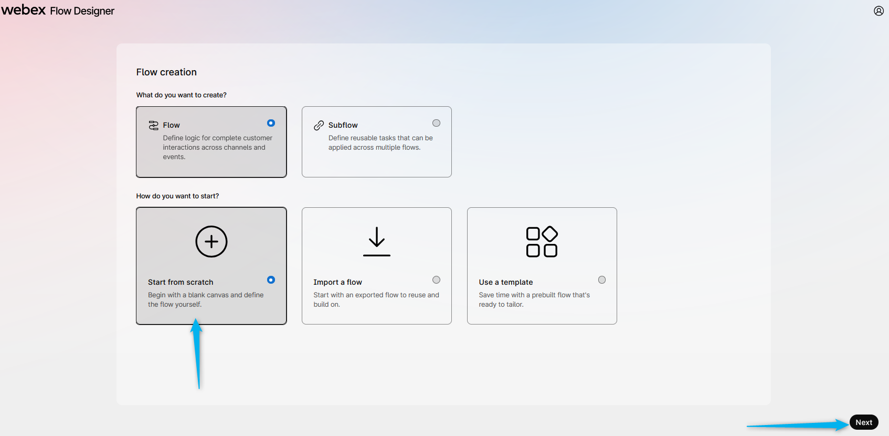

3. Name the new flow **<copy>AutonomousAI_Flow_2000_<w class="attendee"></w></copy>** and click on **Create Flow**.
   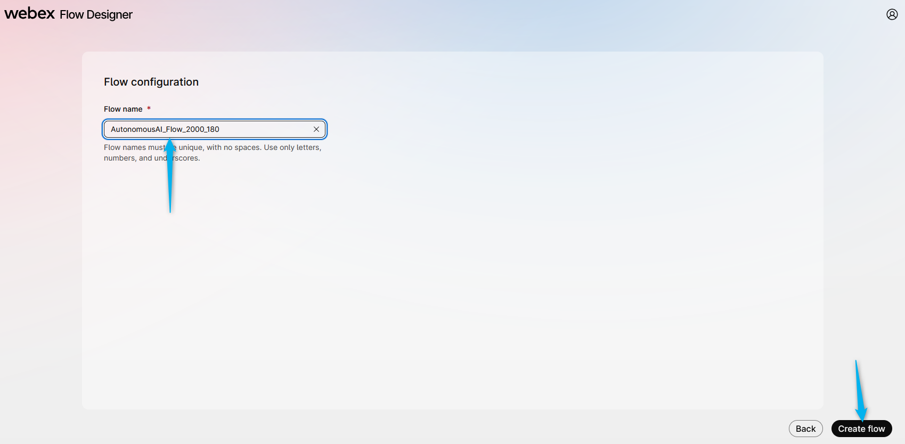

4. Make sure the **Edit** mode at the top is set to **ON**. Then, drag and drop the **Virtual Agent V2** and **Disconnect Contact** activities from the left panel onto the Design field.
    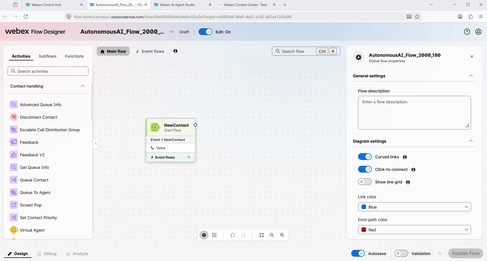

5. Connect the nodes and configure **VirtualAgentV2**:

    - Connect the **New Phone Contact** output node edge to this **VirtualAgentV2** node.
    - Connect the **Handled** outputs to **DisconnectContact**.
    - Click on the **VirtualAgentV2** block and select **Static Contact Center AI Config**.
    - Select Contact Center AI Config as **Webex AI Agent (Autonomous)**.
    - Virtual Agent: **<copy><w class="attendee"></w>\_2000_AutoAI_Lab</copy>**

    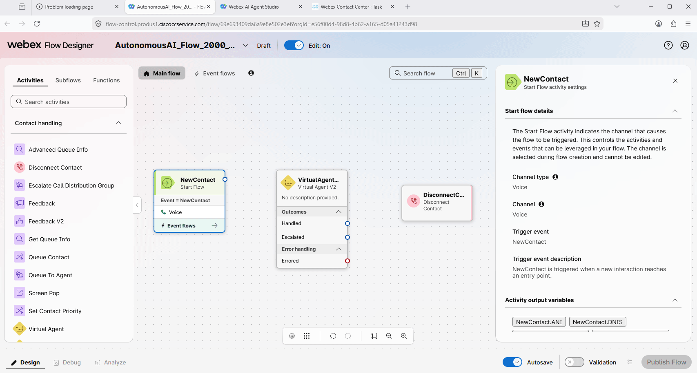

6. Drag and drop **Queue Contact** and **Play Music** nodes. Configure them as the following:

    - **Queue Contact**
    - Connect the **Escalated** path from the **Virtual Agent V2** activity to the **Queue Contact** activity.
    - Connect the **Queue Contact** activity to the **Play Music** activity.
    - Click on the **Queue Contact** node and select **Static Queue**.
    - Queue name: **TS_Voice_Queue**
    - **Play Music**
    - Create a loop by connecting the Play Music activity back to itself - to create a music loop, following the example provided below.
    - Click on the **Play Music** node and select Music File: **defaultmusic_on_hold.wav**.

    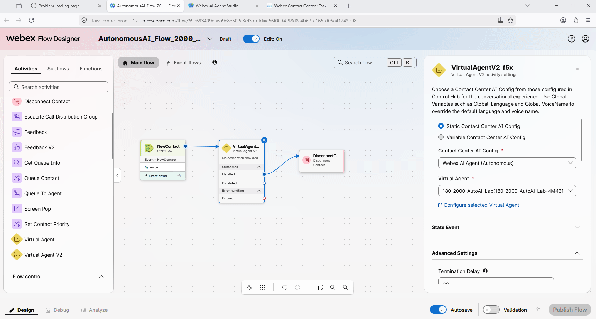

7. **Validate** and **Publish** Flow. In the popped up window, click on dropdown menu to select **Latest** label (**DO NOT** Select any other tag but only **Latest**), then click **Publish**.
   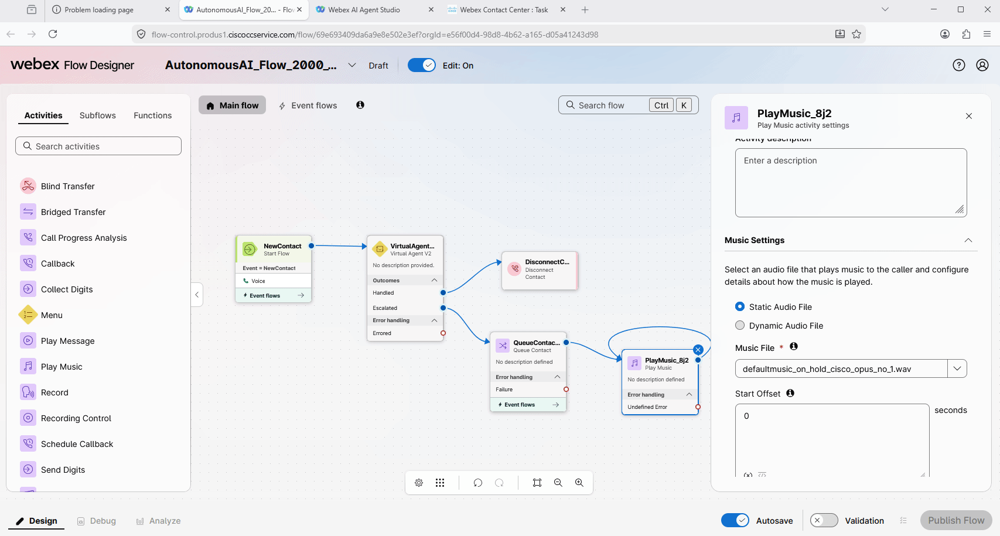

8. Go to **Channels**, find the channel with name **180_2000_Channel** and make the copy of it. 
   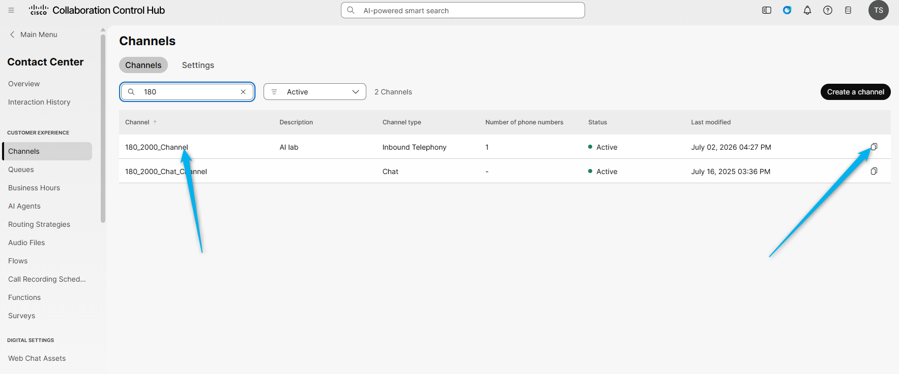

9. Rename the Channel by replacing the **180** with your **last name**1 and removing everything after Channel.
   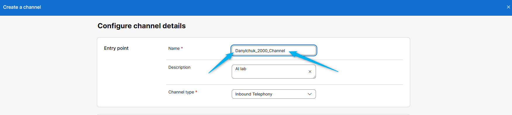 

10. Select the routing flow that you have created earlier.
   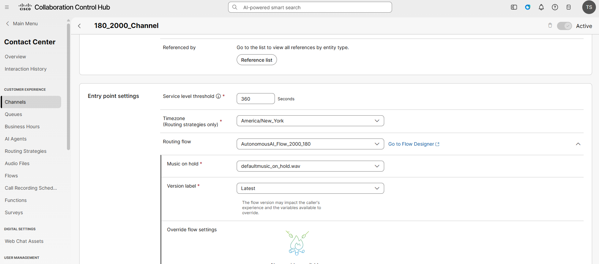

11. On the buttom select any number from Site1 pool.
   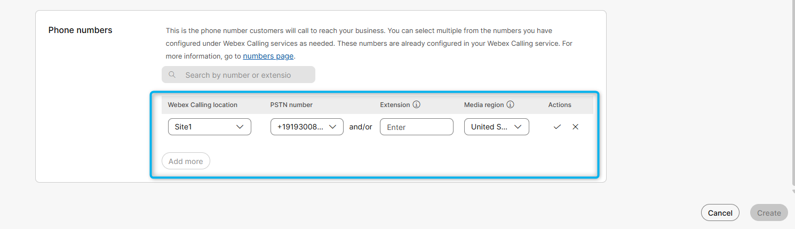

12. Click on **Create**
  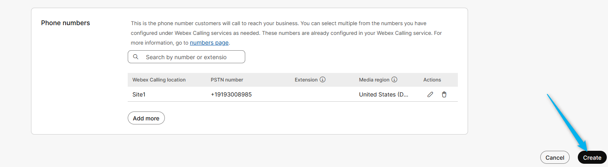

13. Dial the support number assigned to your **<w class="attendee"></w>\_2000_Channel** to test the Autonomous AI Agent over a voice call.
   

<strong>Congratulations, you have officially completed the Autonomous AI Agent lab! 🎉🎉 </strong>

