# Mission 7: Configure Action with MCP

**<details><summary>What is MCP? <span style="color: orange;"></span></summary>**

MCP, or Model Context Protocol, is a standardized framework designed to facilitate the exchange of contextual information between AI models and external systems, enabling more dynamic and context-aware interactions. By using MCP, AI agents can be easily integrated with other external tools, allowing for different types of fulfillment.

## </details>

## Mission overview

In Mission 3, you configured fulfillment by adding an HTTP request node to your voice flow to create an order. Imagine that this HTTP request could be preconfigured on a server, and you simply need to connect your AI agent to that server to utilize it.</br>
</br>
Using an MCP (Model Context Protocol) server is a highly practical approach. If you manage multiple agents and need to configure various fulfillment options for them, you no longer need to rebuild the same logic repeatedly within your flows. Instead, you can simply connect an MCP server and select the specific tool you need. You will love it!</br>

For this mission, the MCP server was created and deployed on AWS with two tools:</br>
1) Check Flower Store Locations. </br>
2) Check the order status by sending API call with the order ID to the MockAPI repository. </br>

This MCP Sever repository you can find on github below. In the **READMe.md** file you will be able to fine instructions on how ot deploy it on AWS. You can use it as the example for implementing the MCP server for you production tenant, but for this lab it is already deployed so the link below is just the reference of the source code. </br>
</br>
**<copy>https://github.com/mdanylch/store_address_2000</copy>**

In this mission you will work on adding this External MCP server to Webex cloud and plug it in with you AI Agent.


---

## Build

### Task 1. Create Agentic App in Webex Developer Portal. 

1. Open [Webex Developer Portal](https://developer.webex.com/){:target="_blank"} .

2. Click on **Login**. Login with you admin credentials.
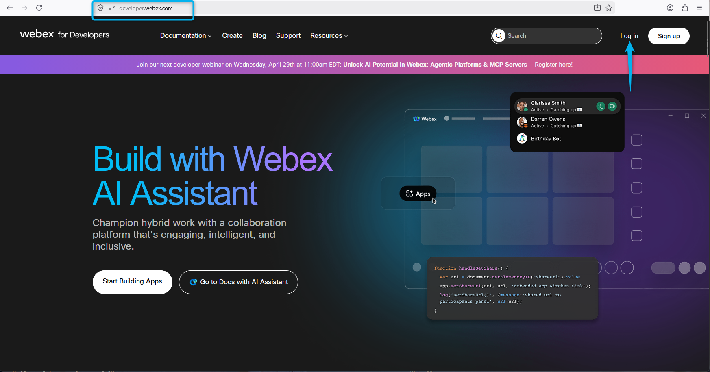

3. Under the Profile, click on **My Webex App**
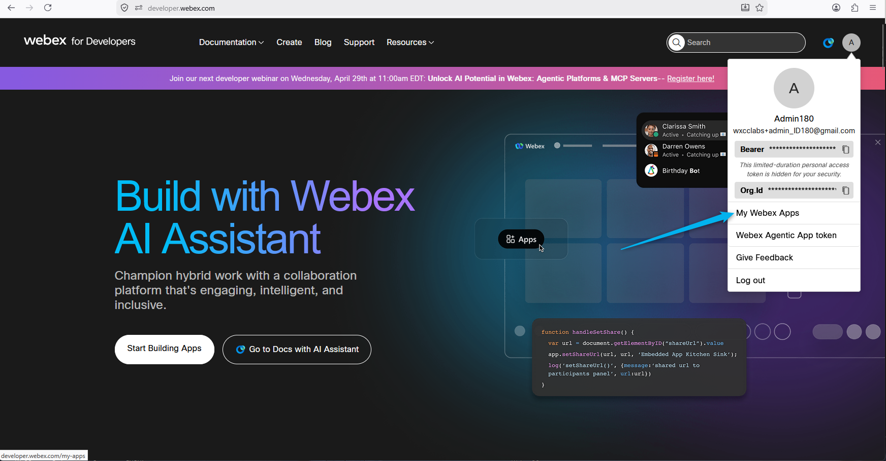

4. Click on **Create a New App**.
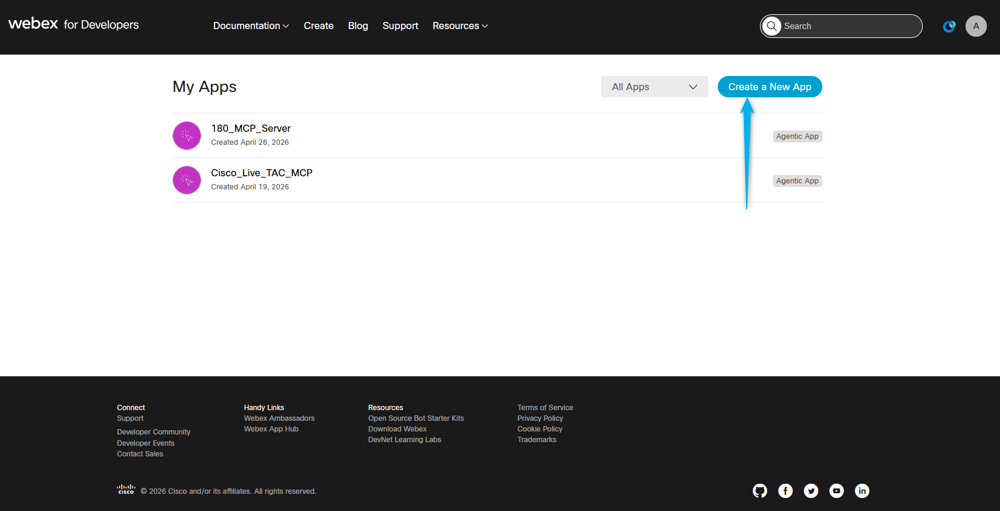

5. On the next page, select **Create an Agentic App**.
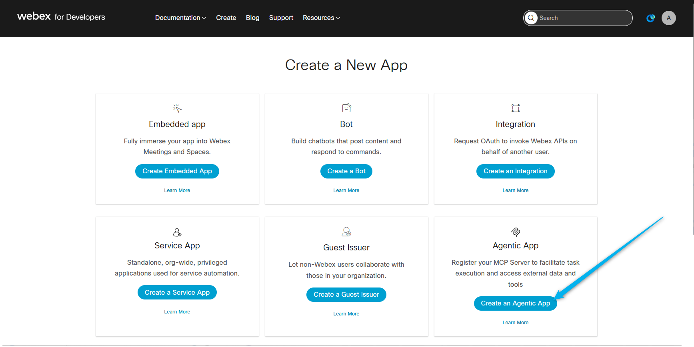

6. Name you app as **<copy><w class="attendee"></w>\_MCP_Server</copy>**
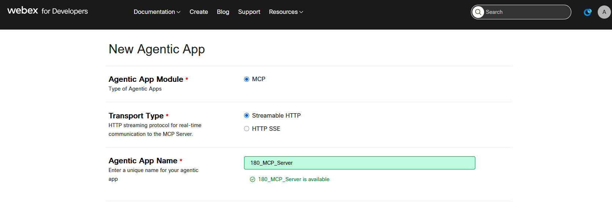

7. For **Agent App Description**, paste the text below (use the **copy** icon on the code block):

    ``` text
    This MCP server is used for the following:

    1) Check the flower store locations
    2) Check the order status based on the order ID.
    ```
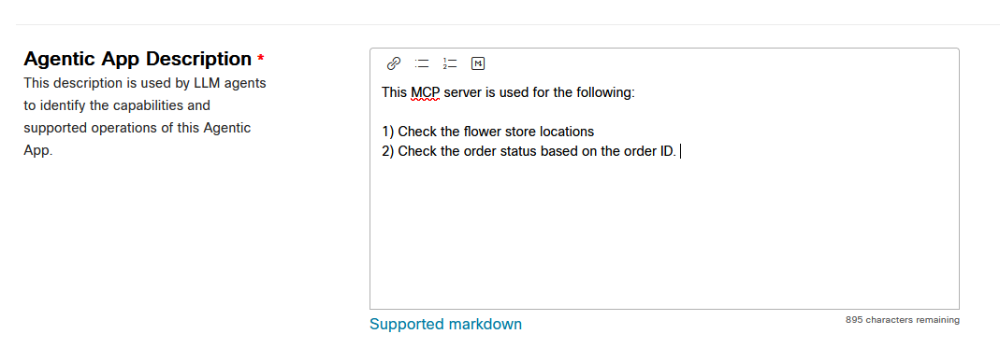

8. Select an available Agentic App Icon. Click 2 times on an Icon. 
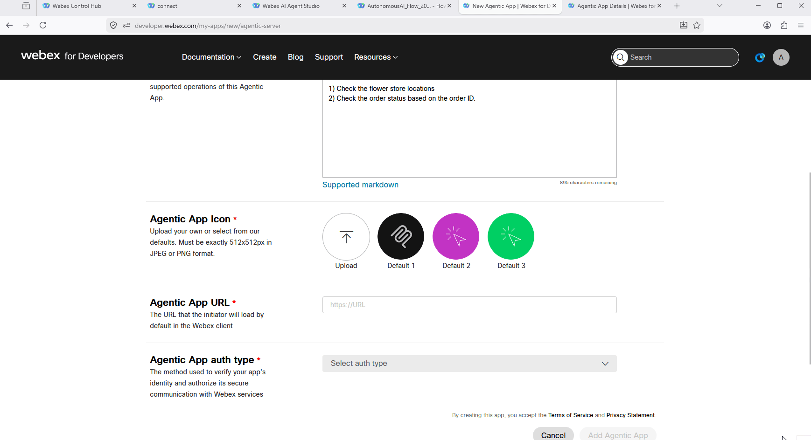

9. For the Agentic App URL enter **<copy>https://y4drgmvgpb.us-east-1.awsapprunner.com/mcp</copy>** and for Agentic App auth type select **Custom Headers**. Finally click on **Add Agentic App**.
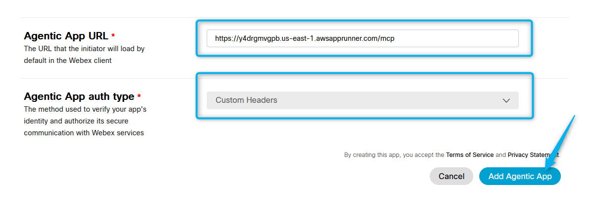


### Task 2. Enable the Agentic App in Control Hub.

1. Go to Control Hub and open **Apps**, then click on **Agentic Apps. 
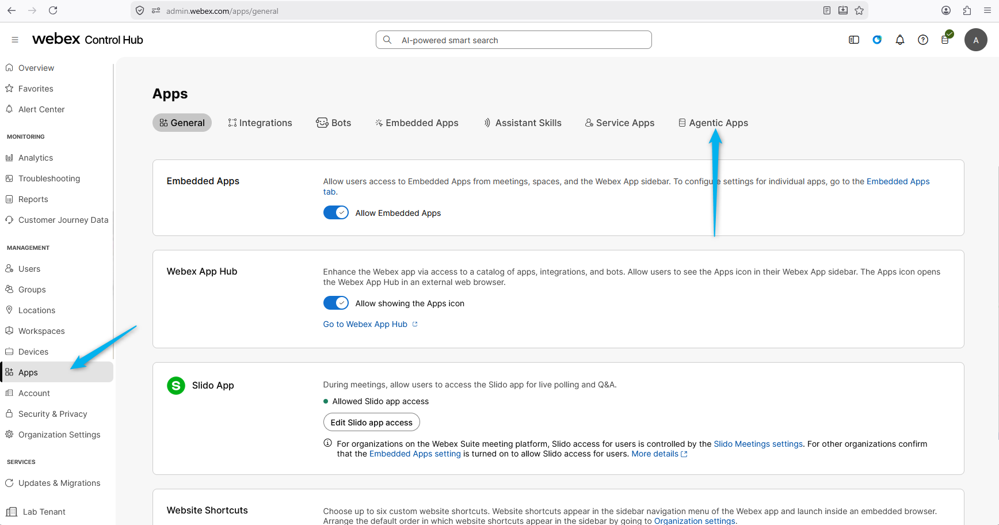

2. In the Apps find your Server name that assosiated to your id **<copy><w class="attendee"></w>\_MCP_Server</copy>** and open it. 

3. Make it **Allowed for all users** and enable the **Authorize automatic server data updates**. Click **Save**.
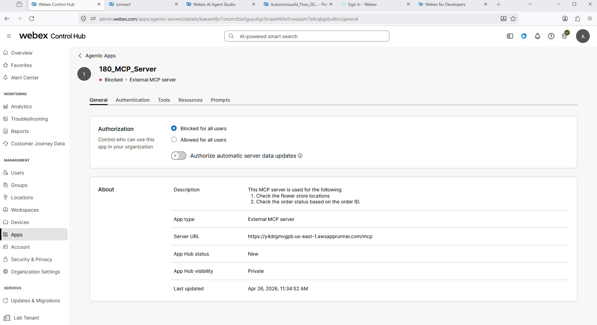

4. Click on **Authentication**. Configure the custom header with **Key 1**: **<copy>MCP_REQUEST_HEADERS</copy>** and the **Value** **<copy>4f9a2b7e1d8c6b3a0f92e4d5c6b8a1f7</copy>**. Then click on **Save**.
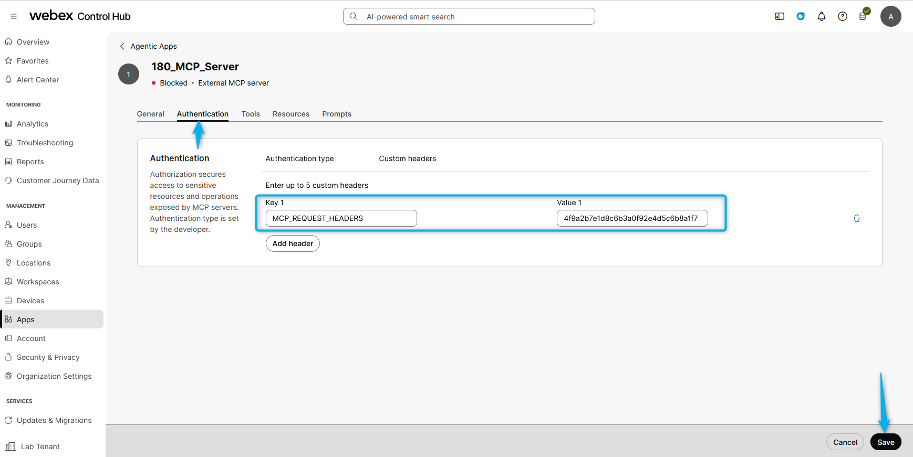

5. Click on **Tools** and Allow **get_store_locations** and **check_order_status** tools and **Allow signature change**. Click **Save**.
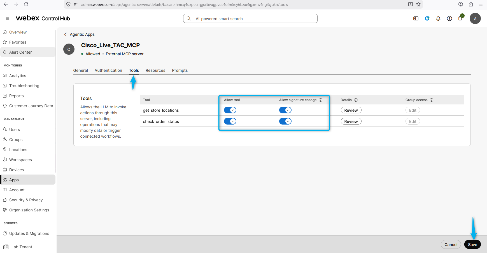

### Task 3. Configure the MCP Server tools with your AI agent. 

1. Open up your AI Agent and go to **Actions**, click on **Add action**, click on **Select available**.
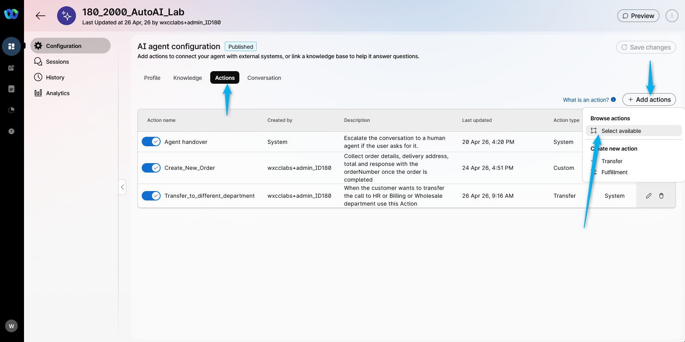

2. Add the tools that associated to your Agentic App name, and click on **Add**.
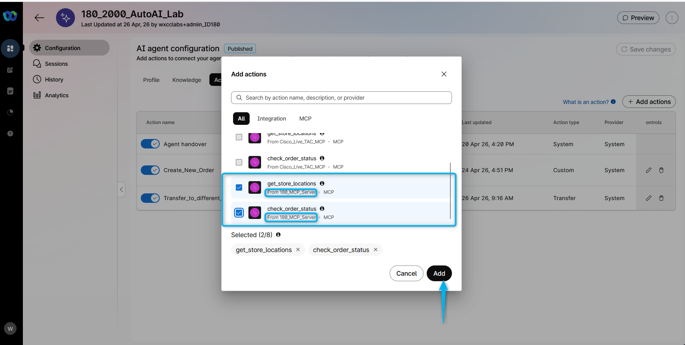

3. **Publish** the changes. 
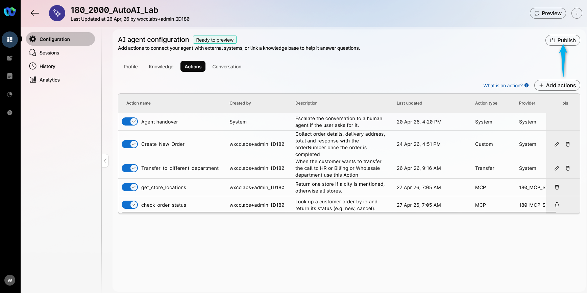

4. Place 2 test calls. On the first call ask for the store location, and second call ask to trace the order that you have created earlier based on the order ID. 

5. You can also test the MCP connections from the **Chat or Voice Preview**.
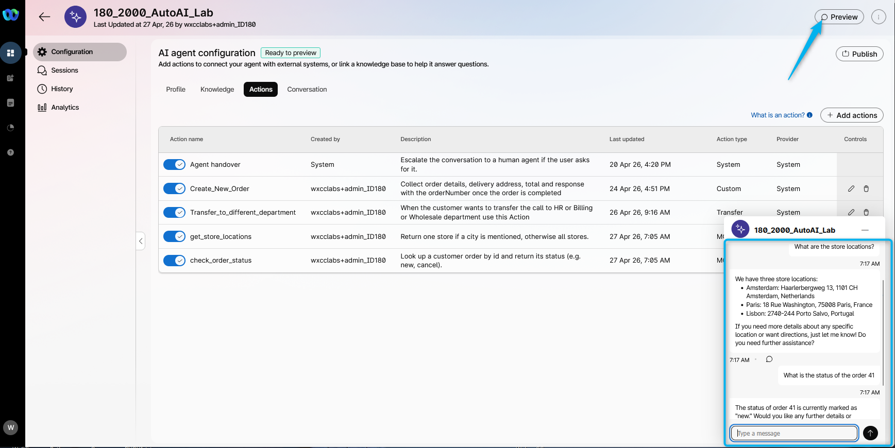

<p style="text-align:center"><strong>Congratulations, you have officially completed this mission! 🎉🎉 </strong></p>
