# Mission 6: Configure Transfer Action for Webex AI Agent

**<details><summary>What is a Transfer to Webex AI Agent Action? <span style="color: orange;"></span></summary>**

Transfer Action is a task that an AI agent performs by understanding user intents and transferring the interaction back to the WxCC flow with custom data for connecting to another Webex AI Agent.

## </details>

## Mission overview

Your mission is to:

For this mission, the proctor has created Webex AI Agent named **Flower_Wholesale**. The goal of this mission is to transfer the call from your AI agent to **Flower_Wholesale** using the Transfer operation. <br>


---

## Build

### Task 1. Adjust Transfer Action in AI Agent Studio portal

1. Open your AI agent with name **<copy><w class="attendee"></w>\_2000_AutoAI_Lab</copy>** and then click on **Actions**.
   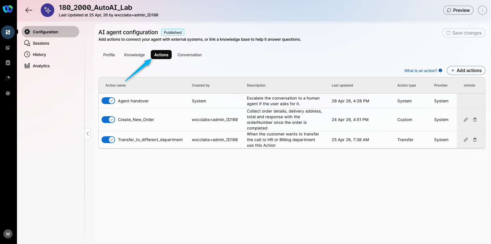

2. Select **Transfer_to_different_department** action.
   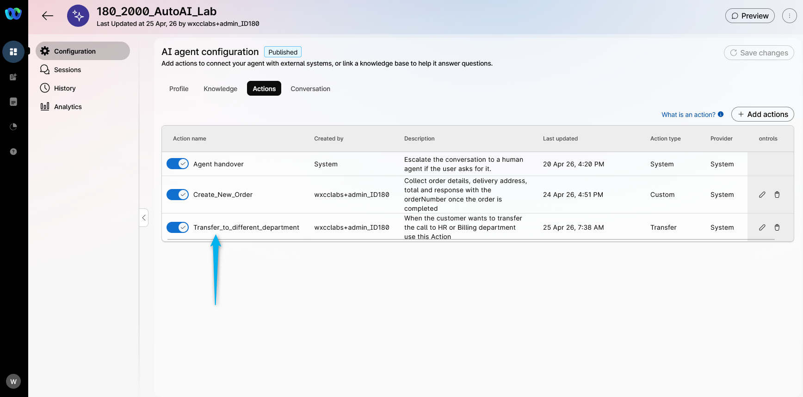

3. Adjust the Transfer condition by adding **<copy>or Wholesale</copy>** as the department option.
   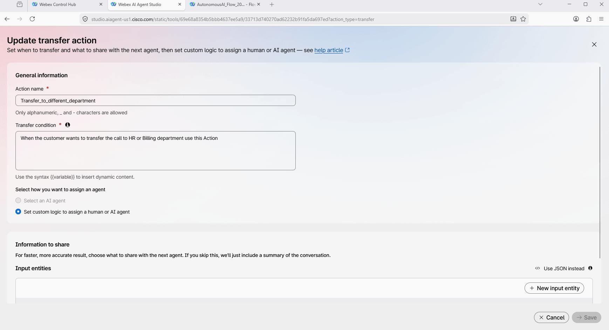

4. Adjust entiry example by adding **<copy>Wholesale</copy>**.
   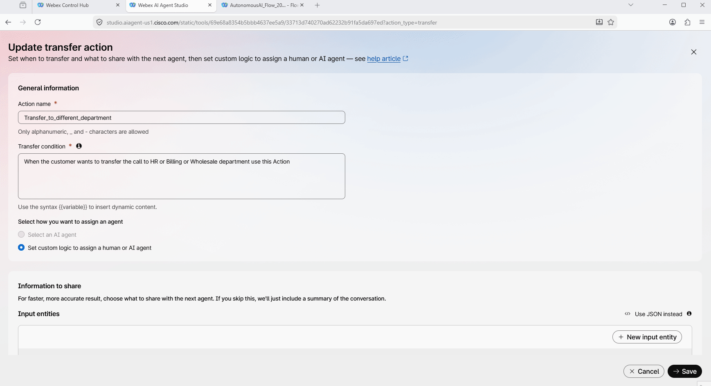

5. **Save** and **Publish** the changes.
   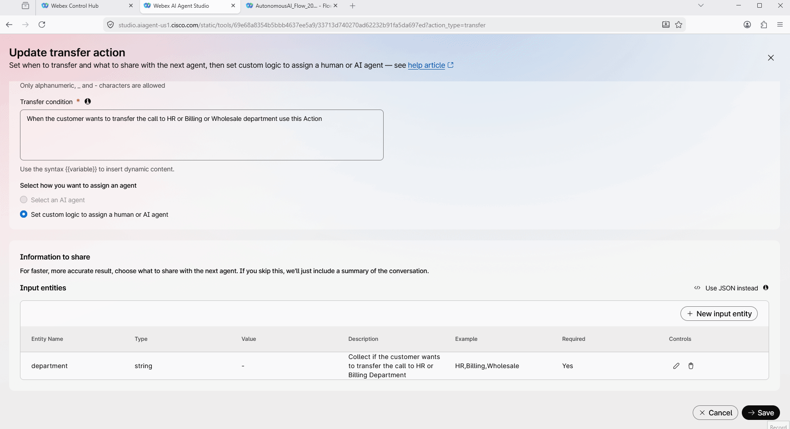

### Task 2. Configure Voice flow to Transfer the call to **Flower_Wholesale** AI Agent

1. Go to **Control Hub** and open up your flow **<copy>AutonomousAI_Flow_2000_<w class="attendee"></w></copy>**. Click on **Edit** the flow.
   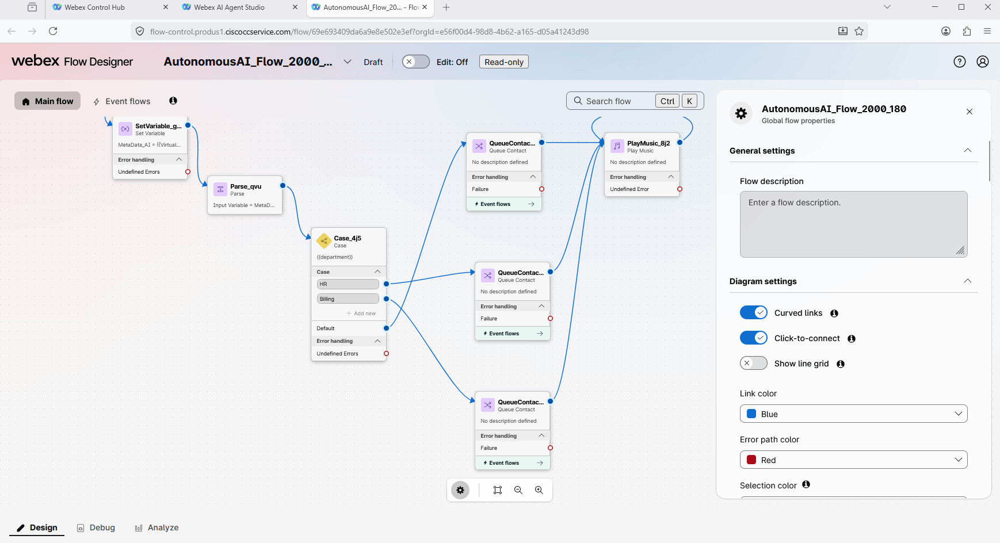

2. Click on **Case** node and add one more option with value **<copy>Wholesale</copy>**.
   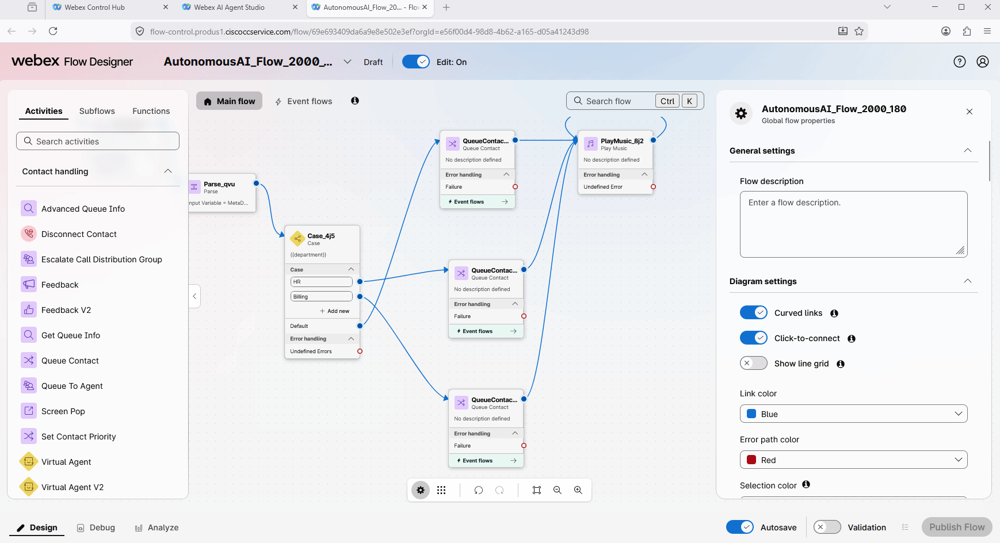

3. Bring additional **VirtualAgentV2** node to the flow.
   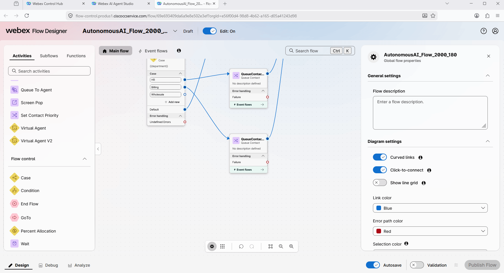

4. Connect **Wholesale** output from **Case** node to **VirtualAgentV2**. Connect **Handled** output from **VirtualAgentV2** to the **DisconnectContact** node. Connect **Escalate** output from **VirtualAgentV2** to Queue that is configured with **<w class="attendee"></w>\_2000_Voice_Queue**.
   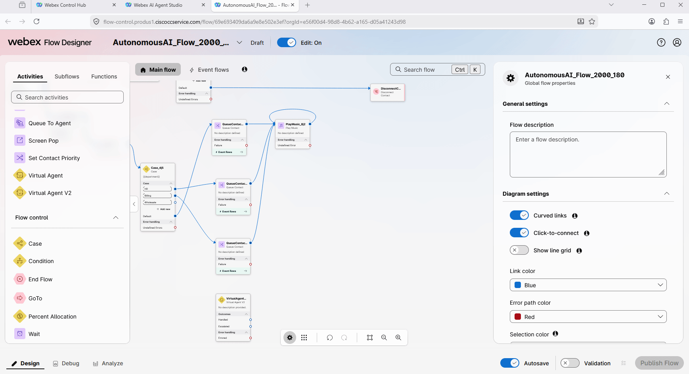

5. Click on the **VirtualAgentV2** and select **Webex AI Agent (Autonomous)** with name **Flower_WholeSale**.
   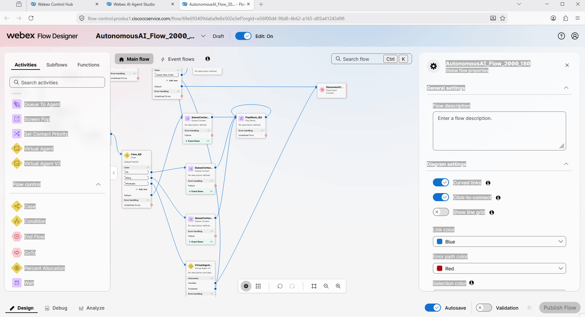

6. **Validate** and **Publish** the flow.
   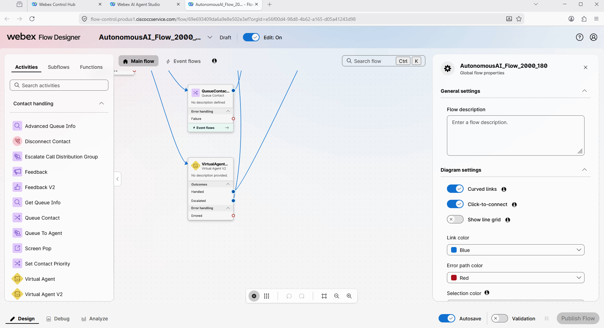

### Task 3. Test Webex AI Agent transfer to Webex AI Agent

Place a call to the number associated with your Channel **<copy><w class="attendee"></w>\_2000_Channel</copy>** and ask to order several boxes or roses. **For example ask for 2 boxes of red roses**. You will be connected to an AI agent who can assist you with ordering flowers if you need to purchase at least one box (each box contains 100 flowers). In this case, the price will be different. Below, you can find the screenshot of the knowledge base used by the Flower_WholeSale AI Agent.


Or you can review the full configuration of the **Flower_Wholesale** AI Agent in the AI Agent Studio.


Task 4. Configure the context share between two AI Agents.

For now when the first AI agent transferred the call to the second AI agent, the context was not shared. So the wholesale AI agent would need to ask the customer question about the context that was already shared with the first AI agent. For example how many boxed of flowers they need. There is feature the share the context between AI agents and you will be enabling it in this Task. 

1. Go to you voice flow and open up the configurations for the Wholesale AI agent
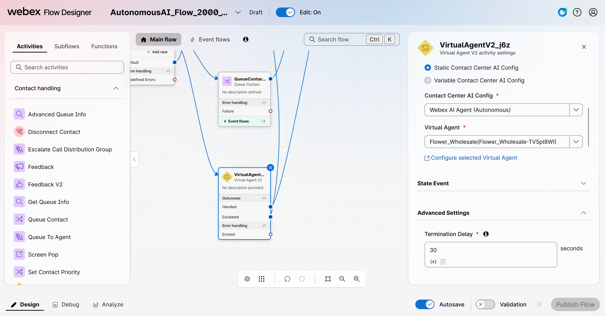

2. Open up **State Event** section and under the **Event Data** enter the following (use the **copy** icon on the code block):

    ``` json
    {
      "agent_metadata": {
        "dynamic_welcome_message": true
      }
    }
    ```

    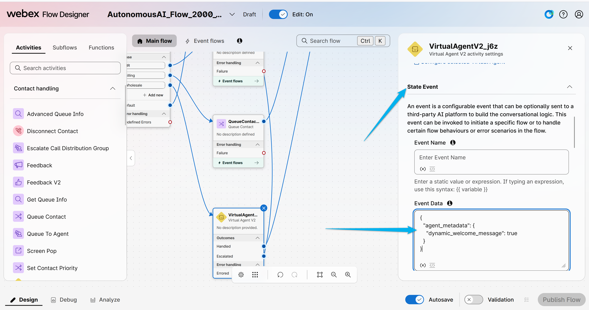

3. Validate and Publish the flow. 
    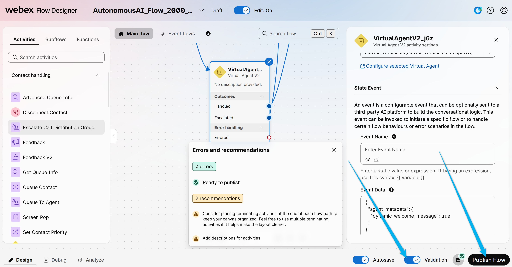


4. Place test call and ask to order 3 boxes of red roses. You should be redirected to the Wholesale department and the second AI agent should know the context of the conversation once it is connected. 

5. In the AI agent settings if you go to **Actions** and open the **Transfer_to_different_department** action there is option to enable the **Announce transfer**. Enable it and place one more test call. You should see the announcement that you call will be transferred to another department 

<p style="text-align:center"><strong>Congratulations, you have officially completed this mission! 🎉🎉 </strong></p>