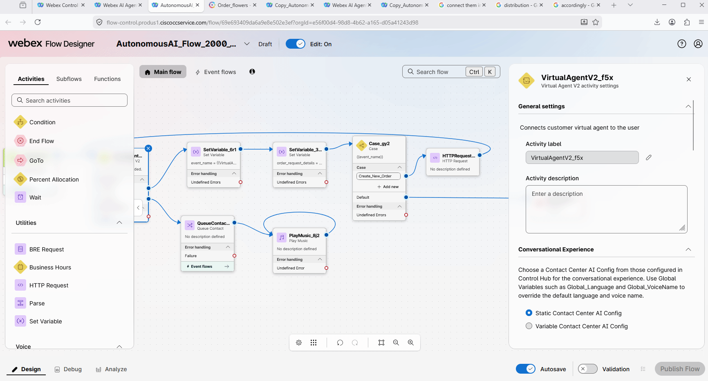
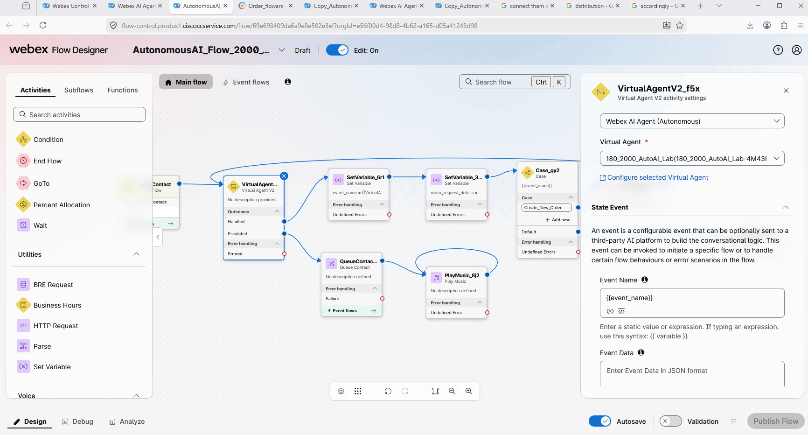
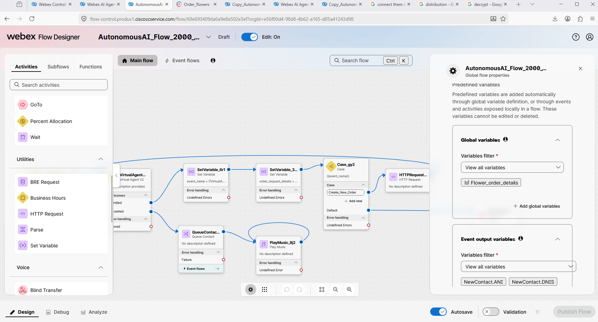
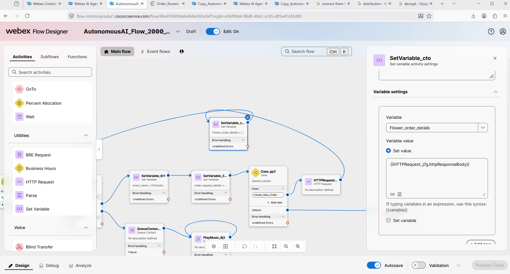

# Mission 4: Configure Fulfillment Action and create an order using **Voice Flow**. 

**

What is fulfilment Action? 
**

Fulfillment Action is a task that an AI agent performs by understanding user intents and completes by connecting to external systems over API. 

## 

## Mission overview

Your mission is to:

In the previous Mission you was using Webex Connect flow to execute tha API calls. For this Mission you will be using the Voice flow to execute the API call to create teh order. 

---

## Build

### Task 1. Configure Create_New_Order action to use voice flow for fulfillment.

1. In the AI Agent Studio, open **Create_New_Order** Action.
   

2. Scroll down and for the **Fulfillment** option select **Manage in the source flow (voice only). Click **Save**
   

### Task 2. Configure fulfillment logic in the Voice flow. 

1. In **Control Hub** got to Flows and open you flow with name **<copy>AutonomousAI_Flow_2000_<w class="attendee"></w></copy>**. Click on **Edit**.
   

2. Remove **DisconnectContact** node. 
   

3. Create flow string variable with name **<copy>event_name</copy>** and empty default value.
    

4. Create flow string variable with name **<copy>order_request_details</copy>** and empty default value.
    

5. Add **SetVariable** node from the left side of flow designer to the field. Connect **VirtualAgentV2** node to the **SetVariable** node. 
    

6. Click on the **SetVariable** that you just created and configure your **event_name** variable to be assigned with **VirtualAgentV2....StateEventName** variable.  
   **Note:** *This event name will be the same as your Action name from the AI Agent Studio that is used for the fulfillment.*
   

7. Add one more **SetVariable** node and connect them in series.
    

8. We will need to assign the metadata from AI agent to the **order_request_details** string variable. To do so click on **VirtualAgentV2** node, on the right side scroll down until you will see Activity output variable. Copy the name of the variable related to MetaData. Go to your second SetVariable node and configure **order_request_details** with value of the Metadata that you copy inside of the {{}}. See the gif below. 
    

9. Add **Case** node and connect **SetVariable** node to the **Case** node.  
    

10. Add **Disconnect Contact** and assign the **Default** output on **Case** node to the **Disconnect Contact**
    

11. Click on **Case** node. Select **event_name** as the Case Variable. Remove the second Link Description. Keep only one Link Description, as for now you have only one action for fulfillment. In the Link Description provide the name of your action: **<copy>Create_New_Order</copy>**.
   **Note:** *If you add more actions later, the Case node is used as the distribution logic for different fulfillment requests.*
   

12. Add **HTTP Request** node and connect the **Case** output link to the **HTTP Request** node.
   

13. Configure the **HTTP Request** with the following:

    - Use authenticated endpoint: **Off**
    - Request URL: **<copy>https://67e9aa0bbdcaa2b7f5b9ed62.mockapi.io/customerOrder</copy>**
    - Method: **POST**
    - Content type: **Application/JSON**
    - Request body: **<copy>{{order_request_details}}</copy>**
       

14. Connect **HTTP Request** node to **VirtuaAgentV2** node.
   

15. Click on **VirtualAgentV2** node, open **State Event** and configure the **Event Name** as **<copy>{{event_name}}</copy>**. In this case when the interaction returns to the AI agent it stays in the same session and AI agent continue the conversation accordingly. 
   

16. Enable decryption in the flow so you can monitor your further test calls details. 
   

17. **Validate** and **Publish** the flow with the **Latest** tag. 
   

18. Place test call to your test number. Ask to order flowers, provide the requested information. Then trace the call in the voice flow. Click on HTTP Request node, decrypt the results to make sure you got 201 status result. 
   

Task 3. Report the order details to Analyzer.

1. Add Global Variable with name **Flower_order_details** to the flow. 
   

2. Add **SetVariable** node and connect it between **HTTP Request** node and **VirtualAgentV2** nodes. 
   

3. Click on **Http Request** node. On the right side scroll down to the Activity output variables, and copy the name that is related to Response Body. Then go to the **SetVariable** block and configure it with Variable **Flower_order_details** and the value that you copied from HTTP Request node inside of the {{}}. See the gif below. 
   

4. Validate and publish the flow. 
   

5. Place one more test call and order flowers. 

6. Open the prebuilt [Analyzer Report](https://analyzer-v2.wxcc-us1.cisco.com/analyzer/view/visualization?tId=e56f00d4-98d8-4b62-a165-d05a41243d98&rId=303296){:target="_blank"} . You should see your call in the list. 
   