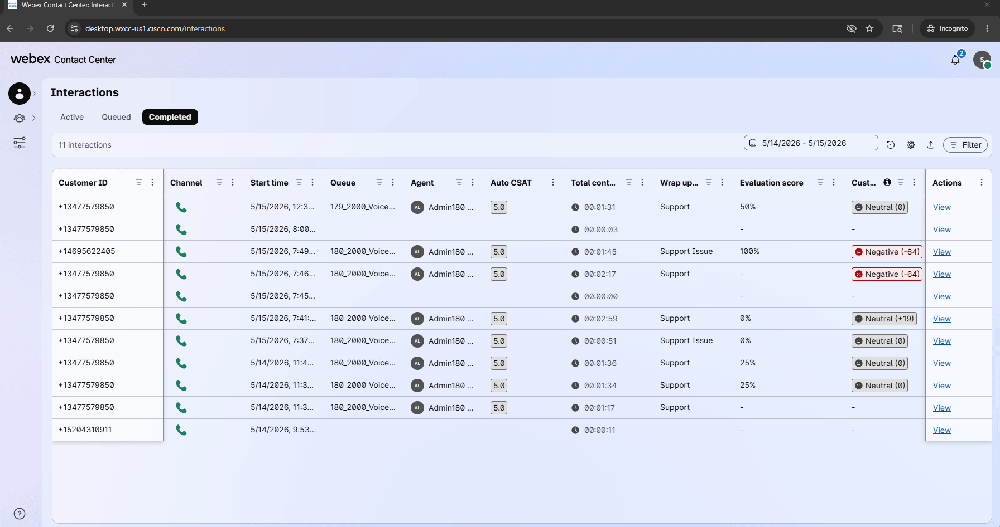
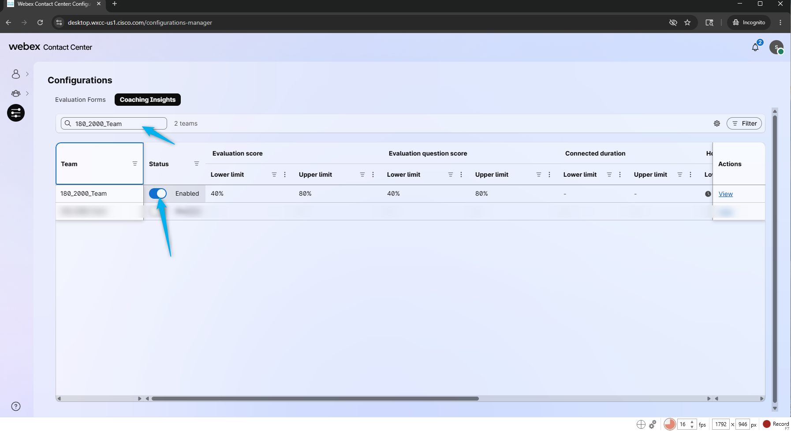
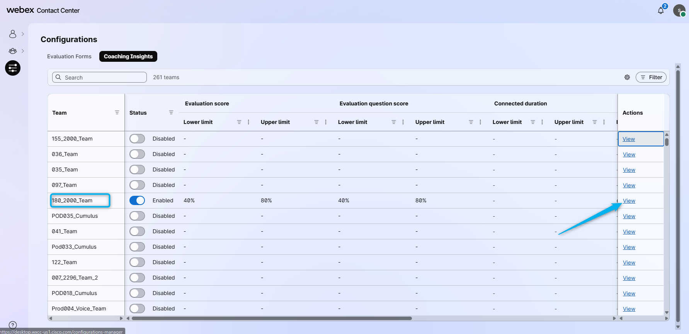
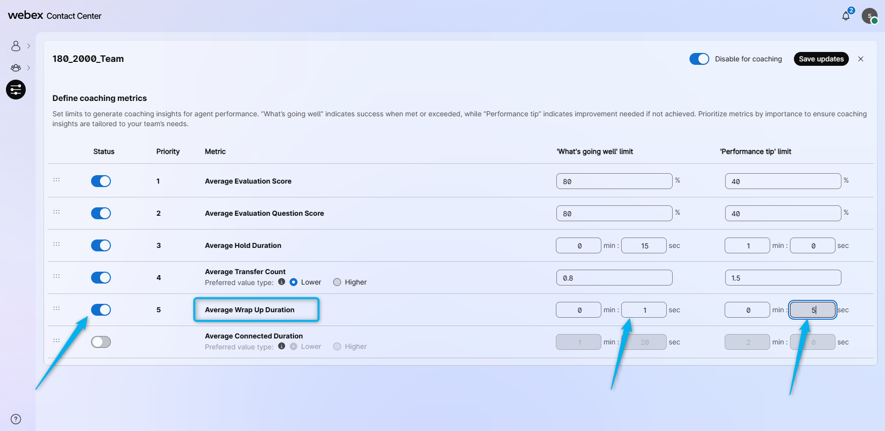
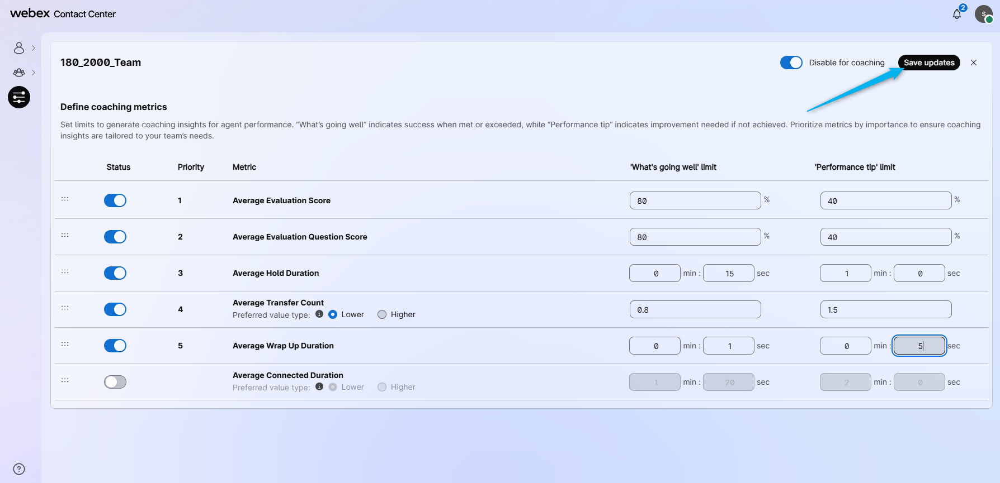
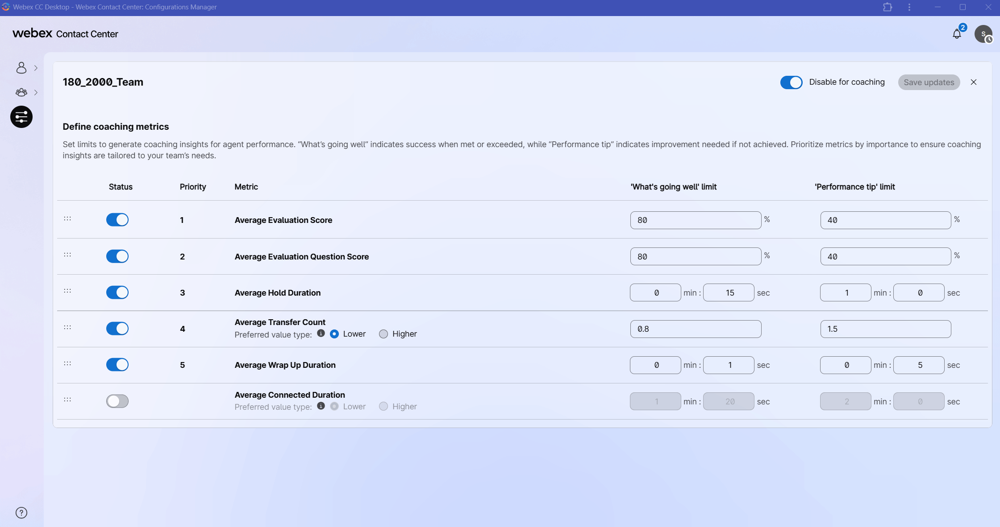
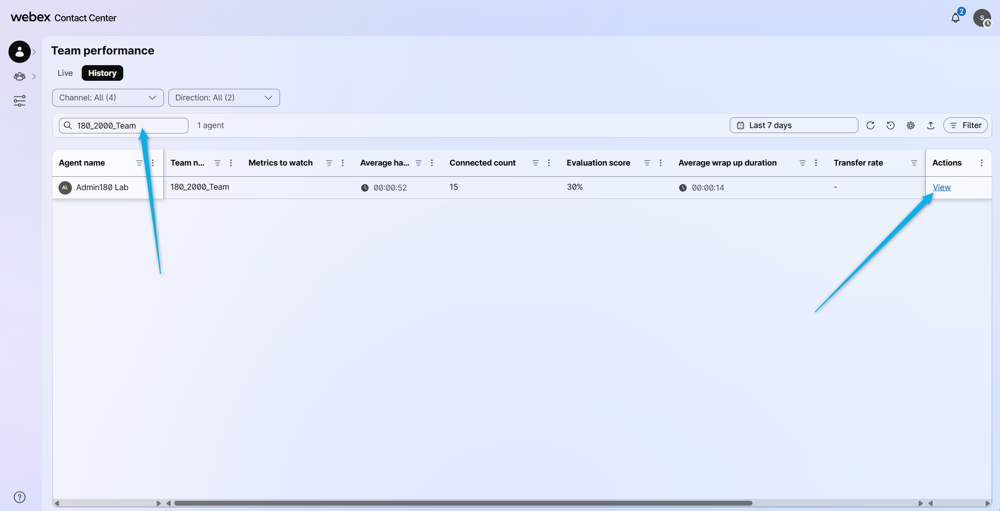
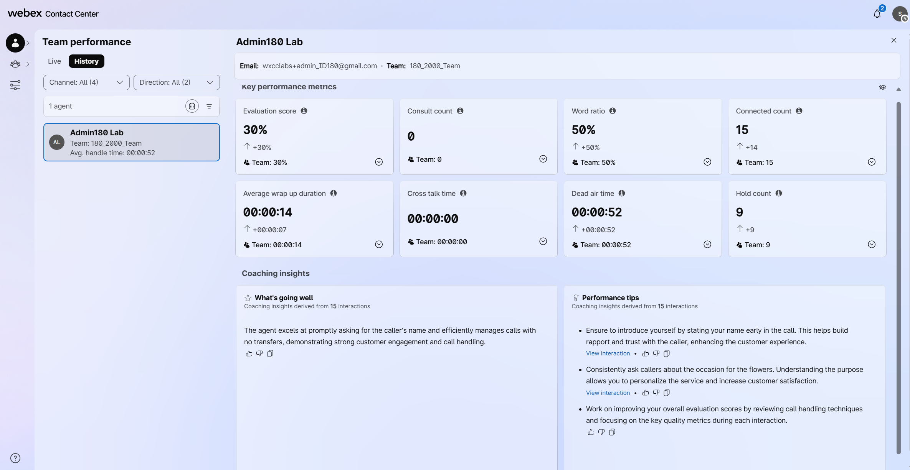

# Mission 1: Configure Coaching Insights.

## Mission overview

Your mission is to:

Configure the Coaching Insights and review the results. 

---

## Build

### Task 1. Enable Coaching Insights

1. In your Supervisor portal go to **Configurations** and then select **Coaching Insights**
   

2. Enable the Coaching Insights for your team. You can search for it using your team name:  **<copy><w class="attendee"></w>_2000_Team</copy>**.
   

3. Click on **View**.
   

4. Enable the **Average Wrap Up Duration** and configure it between 1 and 5 seconds. We are doing it in order to trigger any threshold from these requirements as it will then shows in the Team Performance table.
   

5. Click **Save updates**.
   

6. Place test call, connect it to your agent, let the call be wrapped up automatically. 

7. On Supervisor Dashboard, got to **Team Performance** > **Historical**. 
   

8. Find your team by searching for **<copy><w class="attendee"></w>_2000_Team</copy>**. Then click on **View**
   

9. You will see the Team Performance KPI together with Coaching Insights on the bottom.
   

<strong>Congratulations, you have officially completed this mission! 🎉🎉 </strong>

