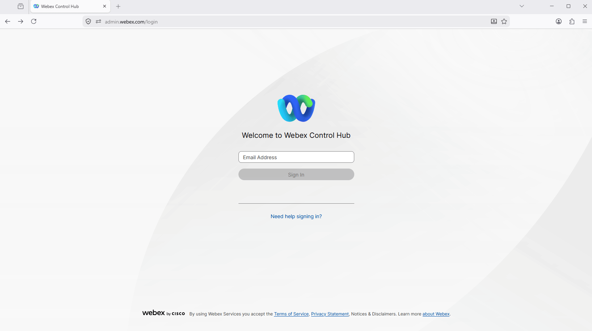
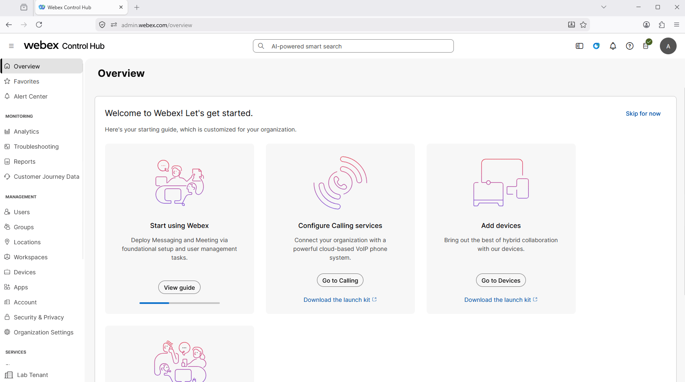
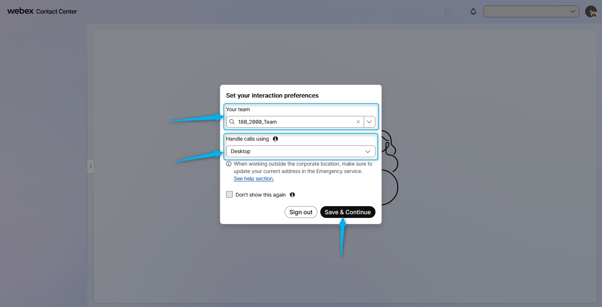
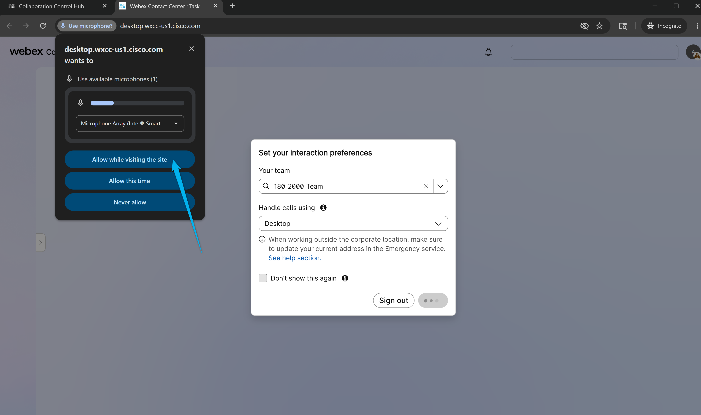
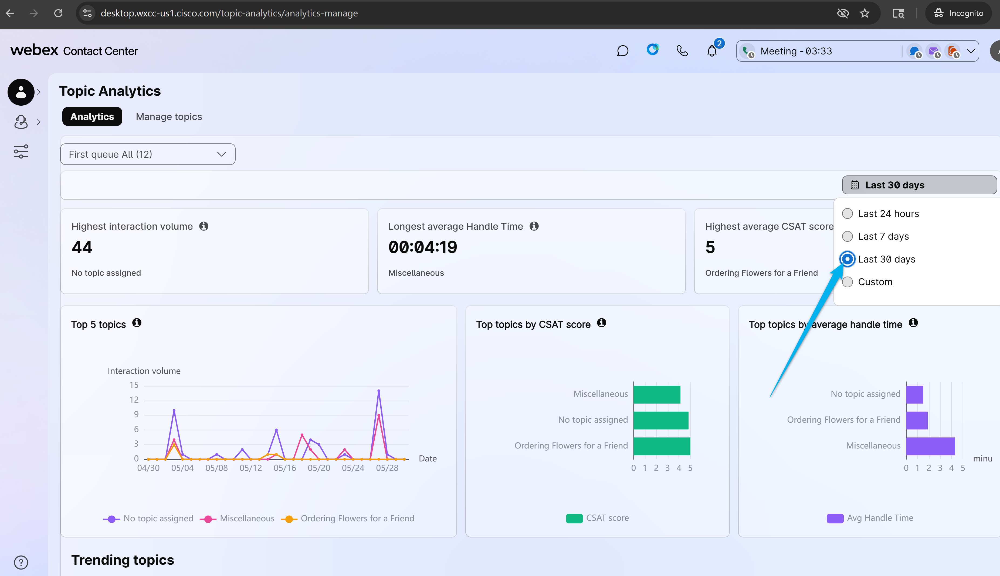
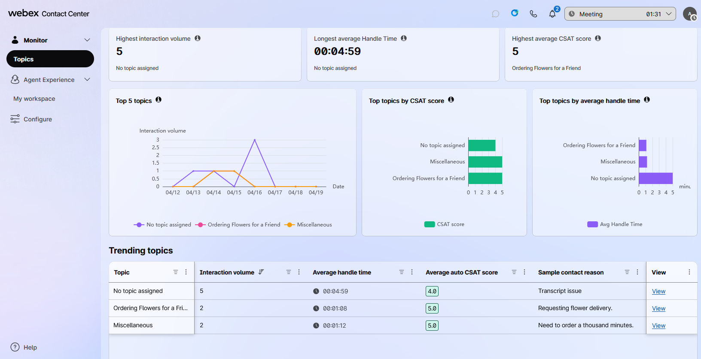
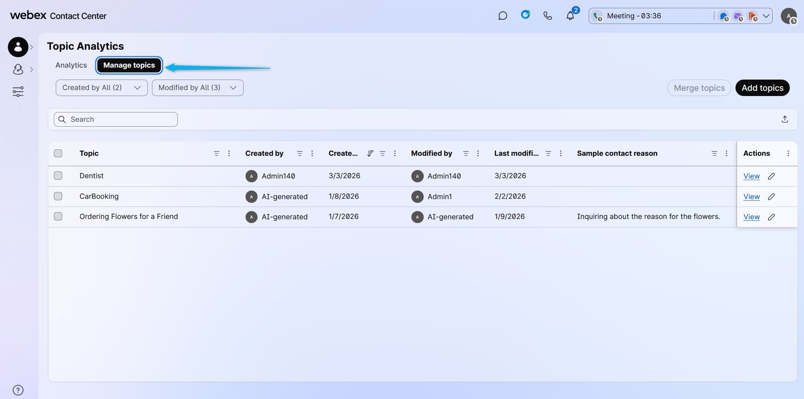
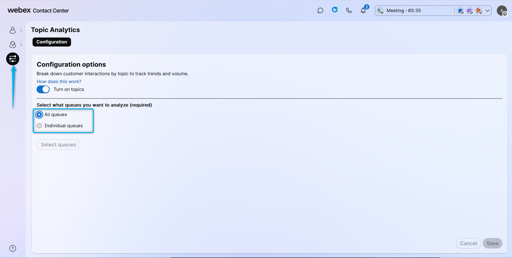
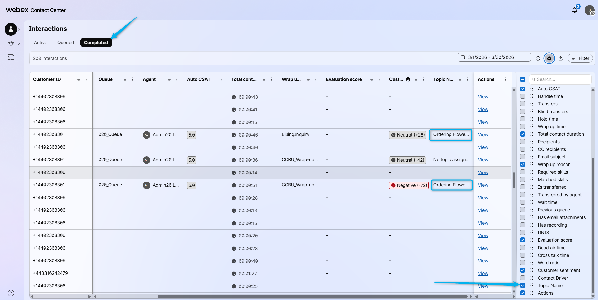
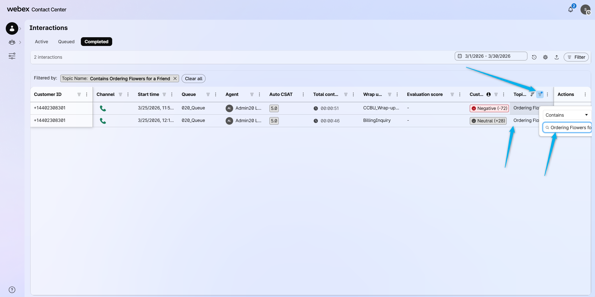

## Feature Description

The all-new topic analytics empowers you to discover emerging topics as customer interactions occur, providing instant visibility into evolving trends and concerns. By automatically labeling each interaction, you gain immediate, actionable insights that enable faster, data-driven decisions. This dynamic approach ensures your team can quickly adapt to changing customer needs, optimize operations, and stay ahead of potential issues.

### Task 1. Review the UI for the Real-Time Topic Dashboard for Administrators. 

1. Login to [Control Hub](https://admin.webex.com){:target="_blank"} using your admin credentials. 
   

2. In **Control Hub** navigate to **Contact Center** and under **Overview** find **Desktop** option. Click on it. 
   

3. Make sure the team is selected that associated with your account. For the Handle calls option use **Desktop**.
   

4. Click on **Allow while visiting the site** to enable your headset to work with Agent Desktop.
   

5. Increase the time window to 30 days.
   

6. The Administrator can review the review the **Topic Dashboard** to understand why customers are calling the Contact Center and see the area that can be automated or improved. 
   

7. The Administrator can **Manage Topics** by merging, deleting or adding new topics.
   

8. In the **Configuration** section, the Administrator can enable Real-Time Topic Analytics for the organization and specify if all or only specific queues should be analyzed using Topic Analytics.
   

### [READ ONLY] Task 2. Real-Time topic on the Supervisor's Dashboard

Supervisors also have access to the Real Time Topic data. Read though on how to see the Topic Data in the Supervisor Dashboard. 

1. You can add **Topic Name** field the the **Completed Interactions** Dashboard.
   

2. You can filter the calls based on the specific **Topic** for the further review.
   

<strong>Congratulations, you have officially completed this mission! 🎉🎉 </strong>

