# Mission 1: Configure Real-Time Assist with Knowledge Base

## Mission overview

Your mission is to:

Create a Knowledge Base for the AI Assistant skill to use. This Knowledge Base will contain documents that provide the necessary information for the AI Assistant to knowledgeably provide suggestions to the agent.

---

## Build

### Task 1. Create Knowledge Base

1. From **Control Hub**, go to Contact Center and open **Webex AI Agent Studio** portal.
   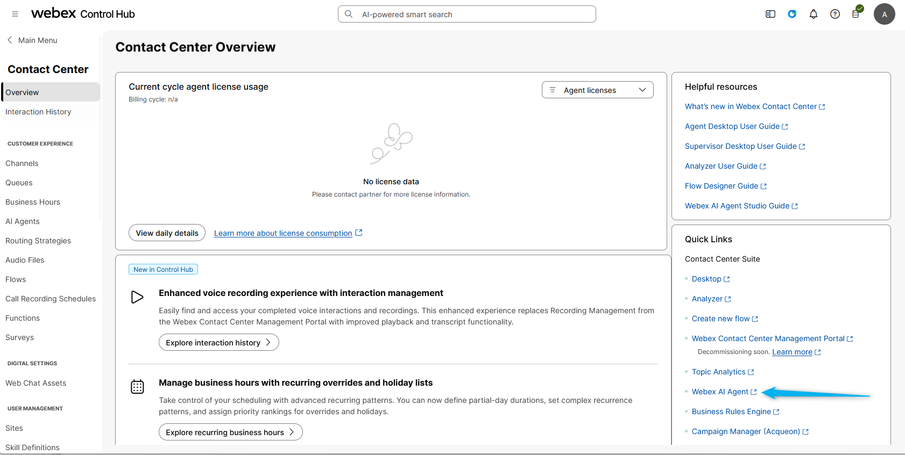

2. Select **Knowledge** and click on **Create Knowledge base**.
   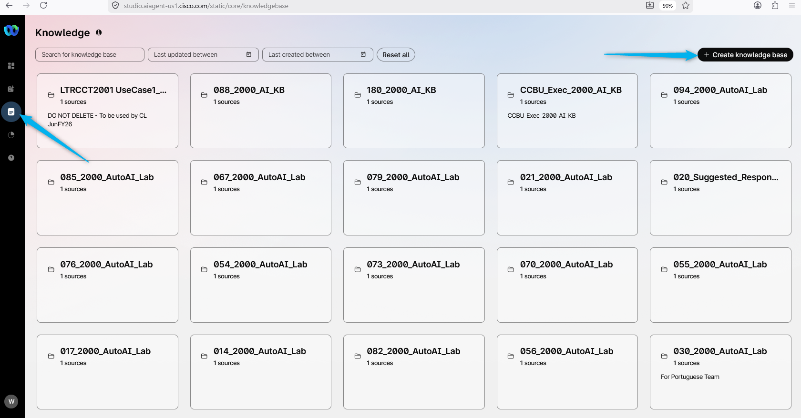

3. Provide the name as **<copy><w class="attendee"></w>\_Suggested_Responses_Knowledge</copy>** and click on **Create**.
   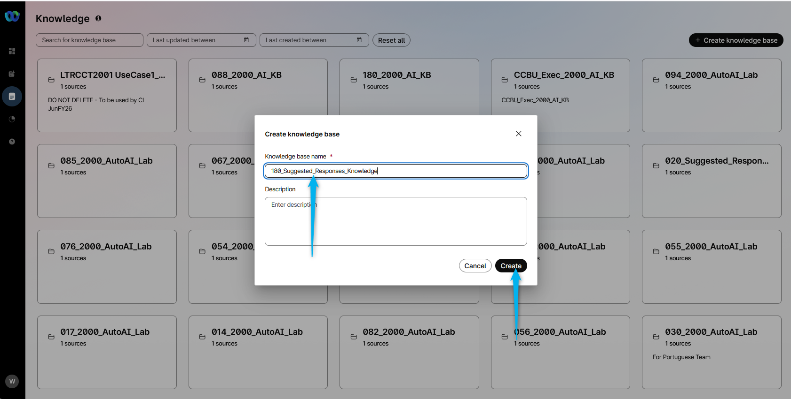

4. Select option **Upload Files**.
   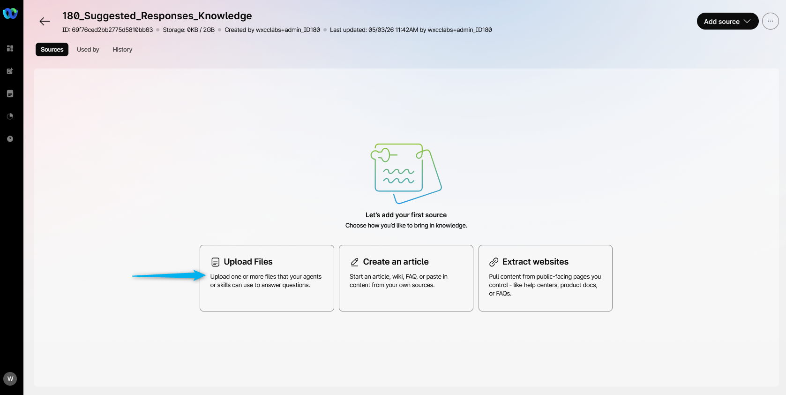

5. Add **Flower_Catalog** file (The same file that you used for the Autonomous AI Agent lab).
   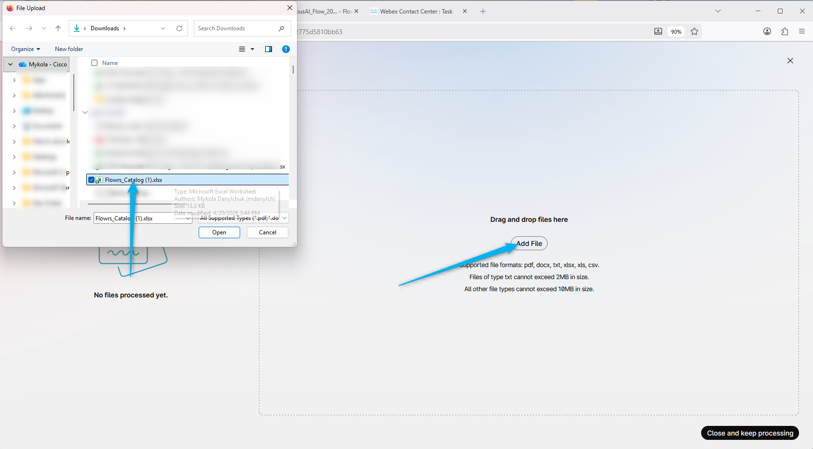

5. **Process** the file. Then click on **Close and keep processing**
   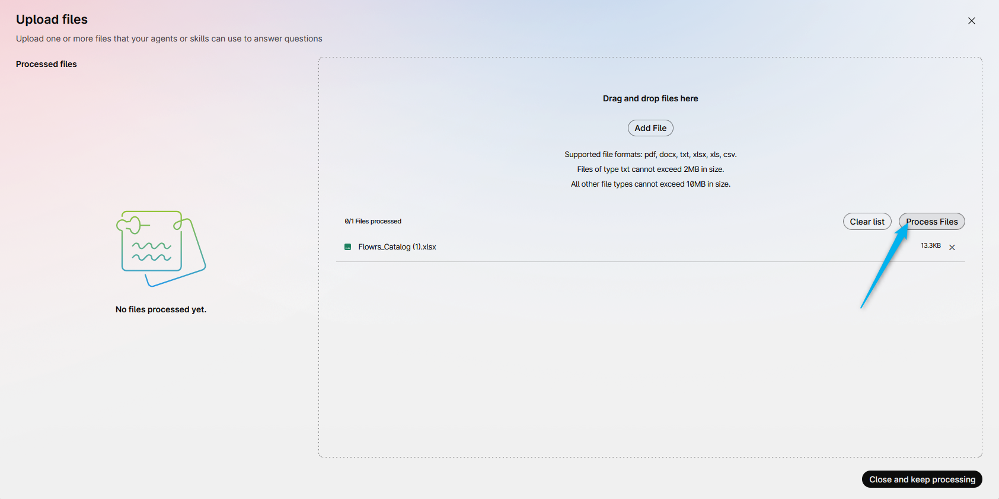

### Task 2. Create AI Assistant skills

1. Now, select **AI Assistant skills** and click on **Create skills**.
   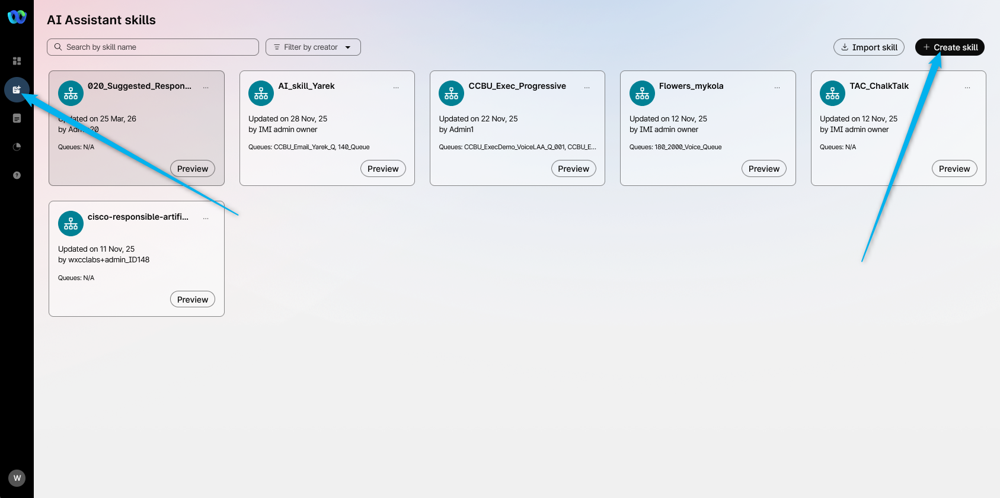

2. Select **Start from scratch** and click **Next**.
   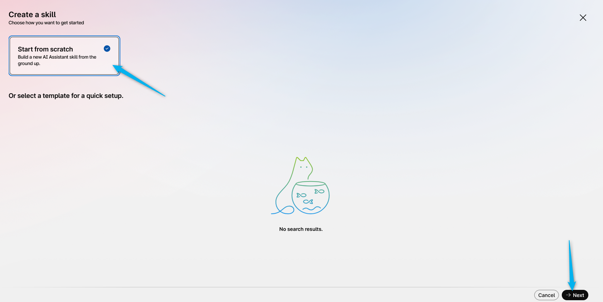

3. Name the skill as **<copy><w class="attendee"></w>\_Suggested_Responses_Skill</copy>**. Describe the goals as **<copy>Answer question about flower suggestion, flower availability, prices, delivery cost and order status.</copy>**. And then click on **Create**.
   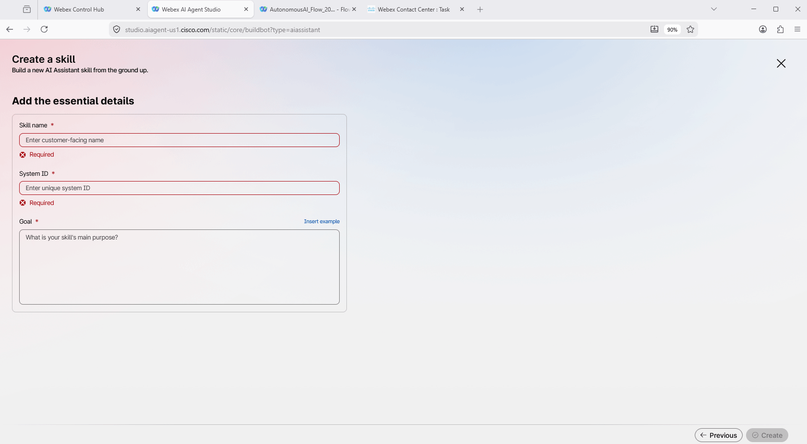

4. Link the knowledge base to the skill in the **Knowledge** section. **Save** and **Publish** the changes.
   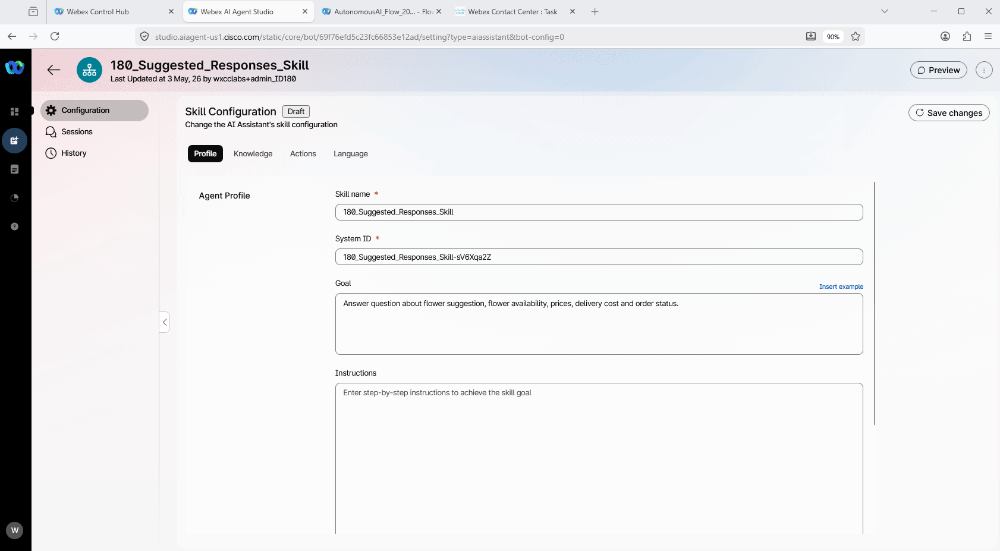

### Task 3. Assign AI skills to your queue

1. In the Webex Control Hub, go to Contact Center, scroll down until you see the **AI Features** module. Open it and select **Queue** tab. 
   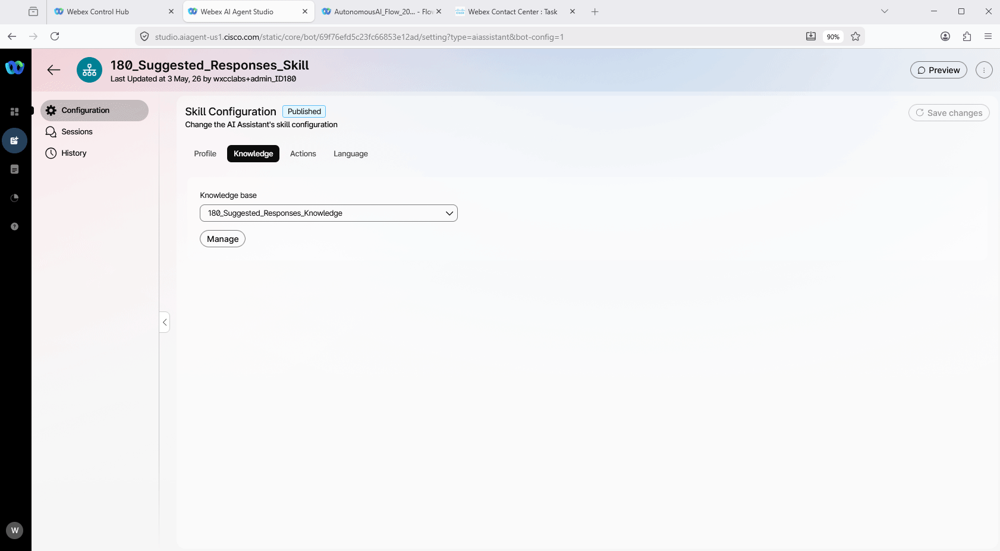

2. Search for your queue **<copy><w class="attendee"></w>\_2000_Voice_Queue</copy>** and open it. Scroll down until you will see **Real-time Assist**. Select your Skill **<copy><w class="attendee"></w>\_Suggested_Responses_Skill</copy>** to be assigned to this queue. Then click **Save**
   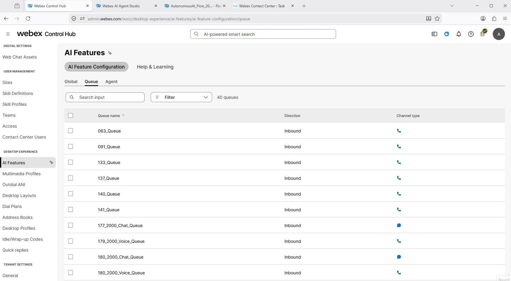

### Task 4. Add "Start Media Stream" block to the voice flow

1. Click on **Edit** in your flow and select **Event Flows**.
   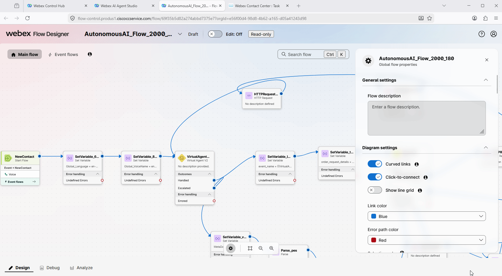

2. Confirm that the **Start Media Stream** is connected to **AgentAccepted**. This configuration should remain if you completed the Real Time Transcript lab.
   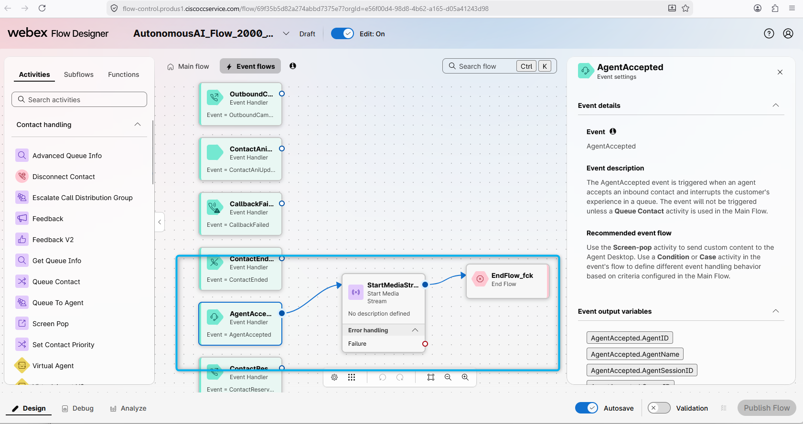

### Task 5. Test Real-Time Assist Feature

1. Make sure you **Agent Desktop** is open and you are in the **Available** status. 
   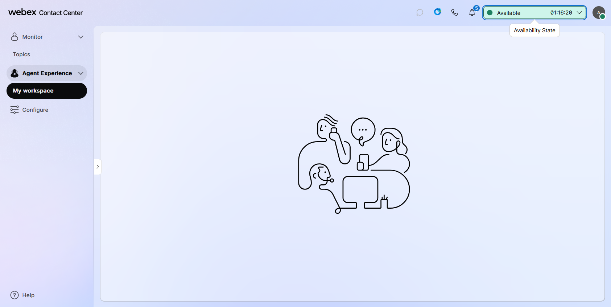

2. Call to the number that is related to your **<copy><w class="attendee"></w>\_2000_Channel</copy>**. Once you connect to the AI agent, ask to speak to a human agent.

3. Once the call is connected to your Agent Desktop, click on the **AI Assistant** module. You will see the option **Get Suggestion**. Click on it. As the caller try to order some flowers. You should see that the AI Agent will suggest flower availability and prices to the human agent based on the Knowledge Base.
   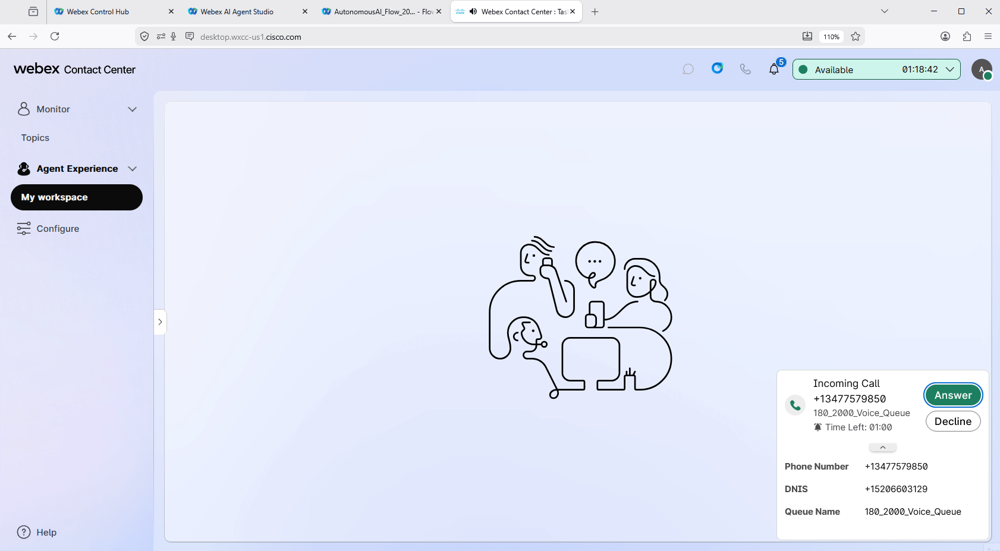

<strong>Congratulations, you have officially completed this mission! 🎉🎉 </strong>

